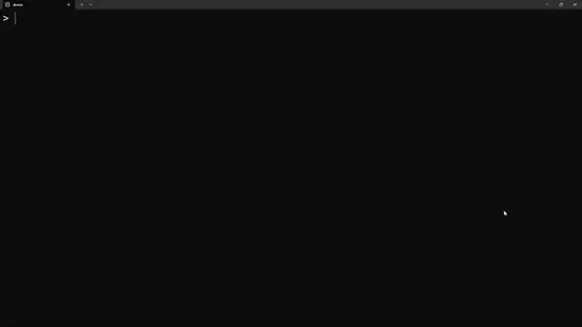

# polyglot c headers

来源 : [你写过的最蠢的代码是？ - 参水猿的回答 - 知乎](https://www.zhihu.com/question/463190146/answer/2769772491)

[English version](./Readme_en.md)

### 功能

用来处理mp4的脚本文件，生成的mp4同时也是一个可以在程序启动时播放自己的c++头文件。

此外，对bash脚本和exe文件也有类似的实现。

### 用法

`python3 ./scripts/build_mp4.py input.mp4 output.mp4 -p -b`

### 效果



### 原理

###### C++

C++有个新（如果C++11也算新的话）特性，即“原始字符串字面量”（raw string literal）。

简单地说，就是用`R"d_sequence()d_sequence"`来包裹一段内容——这段被包住的内容不管是什么都可以原样作为字符串字面量的一部分。

严格地说这么说其实不严谨，首先就是被包裹的内容肯定不能是`d_sequence)"`这种会带来歧义的东西；其次，虽然按照 [这里](https://en.cppreference.com/w/cpp/language/translation_phases#Phase_4) 的说法来看，被替换掉的换行符什么的都会恢复——但实际测试结果可不是这样的；更不用说还有msvc这种见到字符0x1A就罢工的。

所以我们实际上除了用raw-string-literal包裹以外，还需要额外保存一份原始文件的副本，用来播放视频/执行脚本/启动程序。这段没什么特别的，虽然用base64存字符串或者直接incbin应该都行。

啊也就是说，像下面这样，我们就可以在程序里包含一段二进制数据，而不破坏它作为C++代码的正确性了:

```
void f(){(void)R"d_sequence(
    put binary data here!
)d_sequence";}
```


另一个我们要用到的，是一个编译器特性，即常见的编译器都会把忽略程序里的空字符。

##### 

在自动播放这段，我本来想的是对于C++程序声明一个辅助类，用全局变量构造函数做执行；对C程序直接用`__attribute__((constructor))`。结果后来发现C标准没引入raw string literal（悲），只有好心的gcc能让人在C程序里用。

##### mp4

mp4文件是由若干个称为"atom"的段组成的，每个"atom"的开头四字节是长度，随后的四字节是名称。（当然当四字节装不下长度时，会进行扩展，即长度那里写1，然后在名称后面再放八个字节表示长度。）

标准要求把`ftyp`这一atom放在尽可能靠前的位置，仅在必要的签名等信息之后、在其它标准规定有意义的段之前。

啊，我们进行一些测试可以知道，前面只能放几十字节的随机名称的段，但是可以放稍微长一点的`skip`段。

考虑下面这么一个atom。

```
00 00 00 20 2f 2f 61 61 0a 20 20 20 20 20 20 20
20 20 20 20 20 20 20 20 20 20 20 20 20 20 2f 2f
```

它名称叫'//aa'，长度是0x20=32字节。同时，它作为字符串是"\0\0\0 //aa\n  ...... //"。除了空字符和注释外就只有空格，因此它对C++程序没有任何影响，同时留下了一个未完结的单行注释——可以把下一个换行前的内容都注释掉。

在它后面，我们加一个长度为2304字节的`skip`段，最开头的几字节如下：

```
00 00 09 00 73 6b 69 70 0a ......
```

即字符串"\0\0\t\0skip\n"。忽略空字符后，它只包含可打印字符，因此肯定都落在上一段打开的注释内。（啊，理论上没换行符应该就行，但是按刚才那个链接的说法，看起来不受支持的字符会被映射到受支持的字符集，所以还是不赌这个了。）

那么这一段里我们还可以放下将近2k的代码——总之做一些必要的工作后，我们把上面"raw string literal"提到的包裹方法的前半段也放在这里。

之后，在mp4的最后，我们再加一个atom，放入“闭合”这个raw string literal的代码，以及其它的一些用来调用ffplay播放视频的代码。因为这时候atom的头（长度以及名称）还在raw string literal的内部，因此不会影响C++程序的合法性。

至此，我们得到了一个类似下面这样的文件，它既是一个合法的mp4文件，也是一个可以播放视频的C++头文件。

```
<NUL><NUL><NUL>//aa
              //<NUL><NUL>    <NUL>skip
some_c++_code (mainly pragmas and defines)
void f(){(void)R"--------(
    lots_of_binary_data
[four bytes of last atom size][some meaningless atom name]
--------)";}
c++ code to declare the original mp4 as const array or base64 string
c++ code to decode the video and invoke ffplay
```

###### bash 脚本

现在，我们得到了一个mp4，它也是个C++头文件。那我们能不能搞点更可扩展的。

啊，所以我们试着考虑bash脚本。

这还是容易一些的：毕竟bash脚本把'#'开头的行都当成注释，也就是我们可以加预处理指令不会影响脚本的功能。

所以我们可以构造出下文这样的东西……

```
#define echo void f(){(void)
echo R"------(">/dev/null
    original_script
exit 0
)------";
......
```

啊，不过既然我们要处理的只是自己生成的脚本，我们应该可以保证脚本里不会有`#else`或者`#endif`之类的乱七八糟的东西——因此我们直接用一对`#if 0` 和`#endif`把它包起来就好了。

脚本本身的话，用`dd`指令从自身取出来特定区间的内容，送进`base64 -d`命令解码，把解码出来的文件交给指定的程序执行。最后加个`exit(0)`就好了，剩下的内容都不会影响这个文件作为脚本的合法性了。

在这段脚本之后，我们作为C++头文件里的一个字符串，声明原始资源的base64。脚本也就是从这个地方提取资源的。因为`base64`命令可以指定忽略base64编码表以外的字符：比如引号啊逗号啊换行符啊什么的，所以我们甚至可以把它声明成多个短字符串或者怎么样。

最后我们再放进来解码和打开文件的C++代码就好了。

###### Windows 可执行文件

上面我们讨论了脚本文件的玩法只适用于linux——啊，或者说，一部分包含特定命令行工具并兼容sh脚本的系统。

那对Windows来说，我们肯定得试试exe文件对吧。

不幸的是一开始就遇到了问题：众所周知，exe文件的开头两个字节几乎总是"MZ"，而我好像想不到什么办法让一个合法的C++程序以"MZ"开头。

当然，印象里某些上古的C标准应该是允许省略函数返回类型，所以`MZ(){return 0;}`也不是不行——但是现在想找一个支持这个的编译器确实有点麻烦。

啊，我摆烂了！`#define MZ`把`MZ`定义成空就好了啦！我们也可以在后面的代码里加个`#ifndef MZ`就报错的提示：毕竟预编译器报错发生在 [上面那个链接](https://en.cppreference.com/w/cpp/language/translation_phases) 提到的第四阶段，而语法语义分析在第七阶段，我们可以抢在编译器发现MZ这个东西不对劲之前报错（）

然后，幸运的是，dos头里面只有最开始这两个字节和最后四个字节有意义（也就是说我们不能随便乱写）。因此，我们在MZ之后，用中间那些字节”打开“一个原始字符串字面量，把最后四个字节包裹进去就好啦。接下来的dos stub大小没什么限制，所以我们可以结束这个字面量，自由地在dos stub里放一堆乱七八糟的代码，再打开一个字面量包裹后面的exe的”本体“。

啊，这里我们重开dos stub 是因为前面dos头里面空间受限，所以我们建立的raw string literal的d sequence比较短——它未必不在后面的exe中出现，也就不保证无歧义。所以我们重新开一个d sequence比较长的raw string literal。

之后，我们修改PE头，在exe的最后加上一个section。然后用这个section来闭合raw string literal、存储原始exe的一个副本、在编译出的程序启动时将原exe释放到临时文件并执行。

### 缺陷

正如刚才说的，MSVC不支持文件中包含0x1A。据说是基于历史原因，Windows的某些常见CRT以文本模式读文件时把0x1A解释为EOF，而MSVC继承了这种局限。

clang-cl（Windows平台上的Clang，哪怕不开cl兼容）可以编译，但是随着二进制文件大小的增长，编译用时非常快速地增长。不建议使用，可以用mingw gcc，或者单纯在wsl里交叉编译。

### 使用许可

啊，resources目录里的视频和程序不是这个仓库的一部分。实际上就是为了形式上”合规“不侵权（真的有人在乎吗）我才只放了个从公开链接下载它们的脚本。如果要使用请确保不违反它们所有者的条款。

其他部分随便咋用吧，本来也是个乐子。

或者说点形式上的话：本仓库的其它部分以 [WTFPL](http://www.wtfpl.net/txt/copying) 进行授权。
